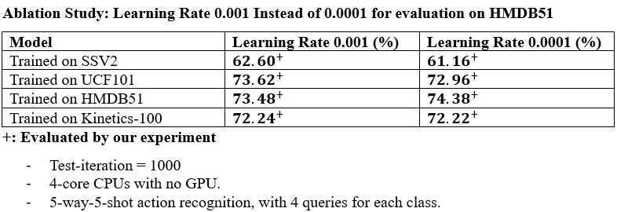
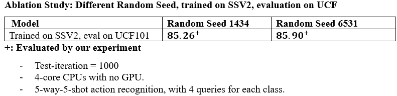

# Evaluating the Generalization Ability of STRM

This repository is dedicated to evaluating the generalization ability of the STRM model. We extend our gratitude to the authors of the original STRM model and the pretrained weights:

- [STRM Model Repository](https://github.com/Anirudh257/strm)
- Pretrained weights for:
  - Something Something V2 Dataset
  - HMDB51 Dataset
  - UCF101 Dataset
  - Kinetics 100 Dataset

We provide several enhancements and additional resources not available in the original repository:

1. **Complete Documentation for Data Preprocessing**
   - Detailed instructions for preprocessing data for three datasets can be found [here](https://github.com/billy-enrizky/Benchmarking-and-Generalization-of-STRM/tree/main/datasets_and_splits/datasets).

2. **Scripts for Video Frame Extraction**
   - Scripts to extract videos into frames for each dataset are available [here](https://github.com/billy-enrizky/Benchmarking-and-Generalization-of-STRM/tree/main/datasets_and_splits). Special thanks to Toby from [this repository](https://github.com/tobyperrett/few-shot-action-recognition).

3. **Generalization Ability Results**
   - While the original paper only provided results for training and testing on the same dataset, we evaluated the generalization ability of each model on three different datasets. The results can be found below:
     

4. **Ablation Study: Learning Rates**
   - We evaluated different learning rates on HMDB51, comparing the learning rate of 0.0001 (as used in the paper) with 0.001. Results are available below:
     

5. **Ablation Study: Random Seeds**
   - We tested how different random seeds affect results, evaluated on UCF101 and trained on SSV2. Results are available below:
     

6. **Compatibility Enhancements**
   - The code has been modified to be compatible with devices without a GPU as well as those with GPU(s).

## Experimental Setup

- **Original Paper Setup**: Test-iteration = 75000, 4 NVIDIA 2080Ti GPUs
- **Our Setup**: Test-iteration = 1000, 4-core CPUs with no GPU
- All other settings are consistent with the original paper.

## Running the Model

### Step 1: Environment Setup

```bash
conda env create -f environment.yaml
conda activate env_ani
```

### Step 2: Data Preprocessing

Download the data and follow the preprocessing instructions for each dataset provided [here](https://github.com/billy-enrizky/Benchmarking-and-Generalization-of-STRM/tree/main/datasets_and_splits).

### Step 3: Download Checkpoints

Download the pretrained weights:
- [SSV2](https://drive.google.com/file/d/19o33BTGc3HwSHPFbqFpD7V8Myhcc7dmq/view?usp=sharing)
- [Kinetics](https://drive.google.com/file/d/1lD8IJInh5llVNDxRCokRLZXZ0knFrF3e/view?usp=sharing)
- [HMDB](https://drive.google.com/file/d/1VDzLPB_DjhtsBbrdLRlnUvh-F1bgEeu-/view?usp=sharing)
- [UCF](https://drive.google.com/file/d/1giQcRHDnMPVca4s9Zjgi-sHUYH9AGBVK/view?usp=sharing)

Place the checkpoints in the root folder.

### Step 4: Evaluate the Model

#### Evaluating on SSV2
Adjust the parameters based on your setup:

```bash
python3 run.py -c checkpoint_dir_ssv2/ --query_per_class 4 --shot 5 --way 5 --trans_linear_out_dim 1152 --tasks_per_batch 16 --test_iters 1000 --dataset ssv2 --split 7 -lr 0.001 --method resnet50 --img_size 224 --scratch new --num_gpus 0 --print_freq 1 --save_freq 1000 --training_iterations 0 --temp_set 2 --test_model_only True --test_model_path checkpoint_ssv2.pt
```

#### Evaluating on UCF101
Adjust the parameters based on your setup:

```bash
python3 run.py -c checkpoint_dir_ucf101/ --query_per_class 4 --shot 5 --way 5 --trans_linear_out_dim 1152 --tasks_per_batch 16 --test_iters 1000 --dataset ucf --split 3 -lr 0.001 --method resnet50 --img_size 224 --scratch new --num_gpus 0 --print_freq 1 --save_freq 1000 --training_iterations 0 --temp_set 2 --test_model_only True --test_model_path checkpoint_ucf.pt
```
python3 run_siamese.py -c checkpoint_dir_ucf101/ --query_per_class 4 --shot 5 --way 5 --trans_linear_out_dim 1152 --tasks_per_batch 16 --test_iters 1000 --dataset ucf --split 3 -lr 0.001 --method resnet50 --img_size 224 --scratch new --num_gpus 0 --print_freq 1 --save_freq 1000 --training_iterations 0 --temp_set 2 --test_model_only True --test_model_path checkpoint_ucf.pt

#### Evaluating on HMDB51
Adjust the parameters based on your setup:

```bash
python3 run.py -c checkpoint_dir_hmdb51/ --query_per_class 4 --shot 5 --way 5 --trans_linear_out_dim 1152 --tasks_per_batch 16 --test_iters 1000 --dataset hmdb --split 3 -lr 0.001 --method resnet50 --img_size 224 --scratch new --num_gpus 0 --print_freq 1 --save_freq 1000 --training_iterations 0 --temp_set 2 --test_model_only True --test_model_path checkpoint_hmdb51.pt
```

**Note**: We are not evaluating on Kinetics-100 as the dataset is no longer available in its 100-version format.

## Contact

For any inquiries, please contact [Muhammad Enrizky Brillian](mailto:billy.suharno@mail.utoronto.ca).
